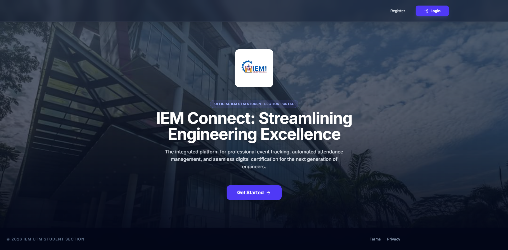
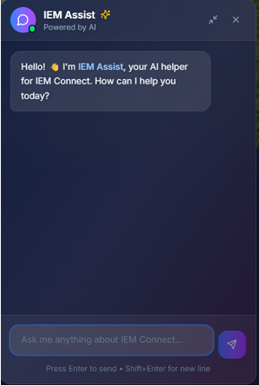
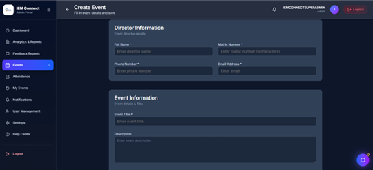
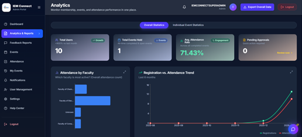

# 🚀 IEM Connect

## 🌐 Live Demo

IEM Connect is a **web-based event management platform** developed for the **IEM UTM Student Section** to centralize event organization, registration, and participation tracking.

The platform allows members to discover events, register for activities, receive announcements, and track participation through a single digital system.

---

# 📌 Problem Statement

Many student organizations manage events using **scattered platforms and manual processes**, leading to:

- Inefficient event registration  
- Difficulty tracking attendance  
- Manual certificate preparation  
- Lack of centralized communication  

**IEM Connect solves these challenges by providing a centralized digital event management platform.**

---

# ✨ Key Features

## 🔐 User Authentication
- Secure user registration and login  
- Two-Factor Authentication (2FA)  
- Admin verification of member accounts  
- Secure logout and session handling  

## 📅 Event Management
- Create and manage events  
- Event announcements  
- Centralized event listing for members  

## 👤 Member Profile Management
- Update personal information  
- Manage user account profiles  

## 📊 Analytics & Reporting
- Event participation tracking dashboard  
- Attendance monitoring  
- Event report generation  

## 🤖 AI Chatbot Support
- Automated responses to event-related questions  
- Assists users with system navigation  

## 🎓 Automated Certificate Generation
- Generates **PDF certificates** for event participants automatically  

---

# 🛠 Technologies Used

| Category | Technology |
|--------|--------|
| **Frontend** | HTML, CSS, JavaScript | 
| **Backend** | Node.js| 
| **Database** | MySQL |
| **Security** | JWT, Two-Factor Authentication |
| **Project Management** | Agile Scrum |
| **Deployment** | Vercel, Render, TiDB, Cloudinary, Brevo |

---

# 👨‍💻 My Role

### Scrum Master – Team GGEZ

- Led Agile development using **Scrum methodology**
- Coordinated sprint planning and sprint reviews
- Facilitated communication between developers and stakeholders
- Monitored project progress using **Kanban boards and sprint metrics**
- Ensured timely delivery of project milestones

---

# 🏗 System Architecture

The platform consists of several core modules:

- Authentication Module  
- Event Management Module  
- User Profile Module  
- Analytics Dashboard  
- AI Chatbot Module  
- Certificate Generation Module  

---

# 📈 Project Outcome

The platform successfully improves:

- Event organization efficiency  
- Participation tracking  
- Communication between event organizers and members  

---

# 👥 Team

**Group GGEZ**

- Chuah Chun Yi — Scrum Master  
- Chong Jun Hong — Backend Developer  
- Muhammad Ariff bin Baharuddin — Frontend Developer  
- Huzsa Syahyzal Haiqal bin Hussain — Frontend Developer  
- Hrishi Vengalsetti — Backend Developer  

---

# 📄 License

This project was developed for **academic purposes at Universiti Teknologi Malaysia (UTM)**.

---

# 🖥 System Preview

---

# 📄 Project Documentation

[LeanCanvas](docs/iPixelo_Report.pdf)

